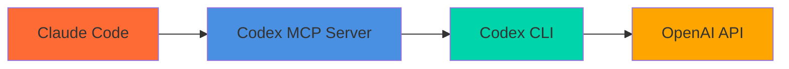

# Codex MCP Server

[](https://www.npmjs.com/package/codex-mcp-server)
[](https://www.npmjs.com/package/codex-mcp-server)
[](https://www.npmjs.com/package/codex-mcp-server)

Bridge between Claude and OpenAI's Codex CLI — get AI-powered code analysis, generation, and review right in your editor.



## Quick Start

### 1. Install Codex CLI

```bash
npm i -g @openai/codex
codex login --api-key "your-openai-api-key"
```

### 2. Add to Claude Code

```bash
claude mcp add codex-cli -- npx -y codex-mcp-server
```

### 3. Start Using

```
Ask codex to explain this function
Use codex to refactor this code for better performance
Use review to check my uncommitted changes
```

## One-Click Install

[](https://vscode.dev/redirect/mcp/install?name=codex-cli&config=%7B%22type%22%3A%22stdio%22%2C%22command%22%3A%22npx%22%2C%22args%22%3A%5B%22-y%22%2C%22codex-mcp-server%22%5D%7D)
[](https://insiders.vscode.dev/redirect/mcp/install?name=codex-cli&config=%7B%22type%22%3A%22stdio%22%2C%22command%22%3A%22npx%22%2C%22args%22%3A%5B%22-y%22%2C%22codex-mcp-server%22%5D%7D)
[](https://cursor.com/en/install-mcp?name=codex&config=eyJ0eXBlIjoic3RkaW8iLCJjb21tYW5kIjoibnB4IC15IGNvZGV4LW1jcC1zZXJ2ZXIiLCJlbnYiOnt9fQ%3D%3D)

## Tools

| Tool | Description |
|------|-------------|
| `codex` | AI coding assistant with session support and model selection |
| `codex_spawn` | Spawn an async Codex subagent job and return `jobId` immediately |
| `codex_status` | Poll status for a subagent job |
| `codex_result` | Fetch final/partial result (stdout/stderr tails + last message) |
| `codex_cancel` | Cancel a running subagent job |
| `codex_events` | Poll normalized incremental events from a subagent job |
| `codex_wait_any` | Wait until any job completes (optional helper) |
| `review` | AI-powered code review for uncommitted changes, branches, or commits |
| `listSessions` | View active conversation sessions |
| `ping` | Test server connection |
| `help` | Get Codex CLI help |

## Examples

**Code analysis:**
```
Use codex to analyze this authentication logic for security issues
```

**Multi-turn conversations:**
```
Use codex with sessionId "refactor" to analyze this module
Use codex with sessionId "refactor" to implement your suggestions
```

**Code review:**
```
Use review with base "main" to check my PR changes
Use review with uncommitted true to review my local changes
```

**Advanced options:**
```
Use codex with model "o3" and reasoningEffort "high" for complex analysis
Use codex with fullAuto true and sandbox "workspace-write" for automated tasks
```

## Requirements

- **Codex CLI v0.75.0+** — Install with `npm i -g @openai/codex` or `brew install codex`
- **OpenAI API key** — Run `codex login --api-key "your-key"` to authenticate

## Documentation

- **[API Reference](docs/api-reference.md)** — Full tool parameters and response formats
- **[Session Management](docs/session-management.md)** — How conversations work
- **[Codex CLI Integration](docs/codex-cli-integration.md)** — Version compatibility and CLI details

## Subagent Orchestration (Codex CLI as MCP Client)

This server can be used from Codex CLI itself via `codex mcp` (experimental) to enable “subagent-style” orchestration:
the main Codex run issues multiple MCP tool calls in a single message, each spawning a separate `codex exec` process.

### Configure in Codex CLI

Example (local checkout):

```bash
codex mcp add codex-cli-wrapper -- node /abs/path/to/mcp/codex-mcp-server/dist/index.js
codex mcp list
```

Note: Codex normalizes server names when forming tool identifiers (hyphens become underscores). For a server named
`codex-cli-wrapper`, the tool identifier prefix is `mcp__codex_cli_wrapper__...`.

### Default sandbox for subagents (workspace-write)

If the goal is for subagent calls to consistently have write permissions without repeating `sandbox="workspace-write"`
in each call, configure the MCP server to provide a default:

```bash
codex mcp remove codex-cli-wrapper
codex mcp add codex-cli-wrapper --env CODEX_MCP_DEFAULT_SANDBOX=workspace-write -- node /abs/path/to/mcp/codex-mcp-server/dist/index.js
```

With this setting, the MCP `codex` tool uses `workspace-write` when the `sandbox` argument is omitted.

For async subagent jobs spawned via `codex_spawn`, the same defaulting behavior applies.

### Safety valve: max concurrent subagents

To prevent accidental resource exhaustion, async subagent jobs are capped by default:

- `CODEX_MCP_MAX_JOBS` (default `32`) limits concurrently running `codex_spawn` jobs.

If more concurrency is needed, set a higher value in the MCP server environment.

### Parallel read-only exploration (safe default)

In a Codex session, the main agent can fan out parallel exploration subtasks by making multiple calls to
`codex-cli-wrapper.codex` with `sandbox="read-only"` and the same `workingDirectory`.

### Phased writes (avoid same-file races)

Avoid parallel writes to the same file. Prefer a phased flow:
1) parallel exploration (read-only)
2) serialized or non-overlapping edits (workspace-write)
3) tests/lint in a dedicated step

### Inheriting model/reasoning defaults

To keep main-agent and subagent runs consistent, prefer letting Codex CLI load defaults from `~/.codex/config.toml`:
- do not pass `model` unless an override is needed
- do not pass `reasoningEffort` unless an override is needed

## Development

```bash
npm install    # Install dependencies
npm run dev    # Development mode
npm run build  # Build for production
npm test       # Run tests
```

## Related Projects

- **[gemini-mcp-server](https://github.com/tuannvm/gemini-mcp-server)** — MCP server for Gemini CLI with 1M+ token context, web search, and media analysis

## License

ISC
